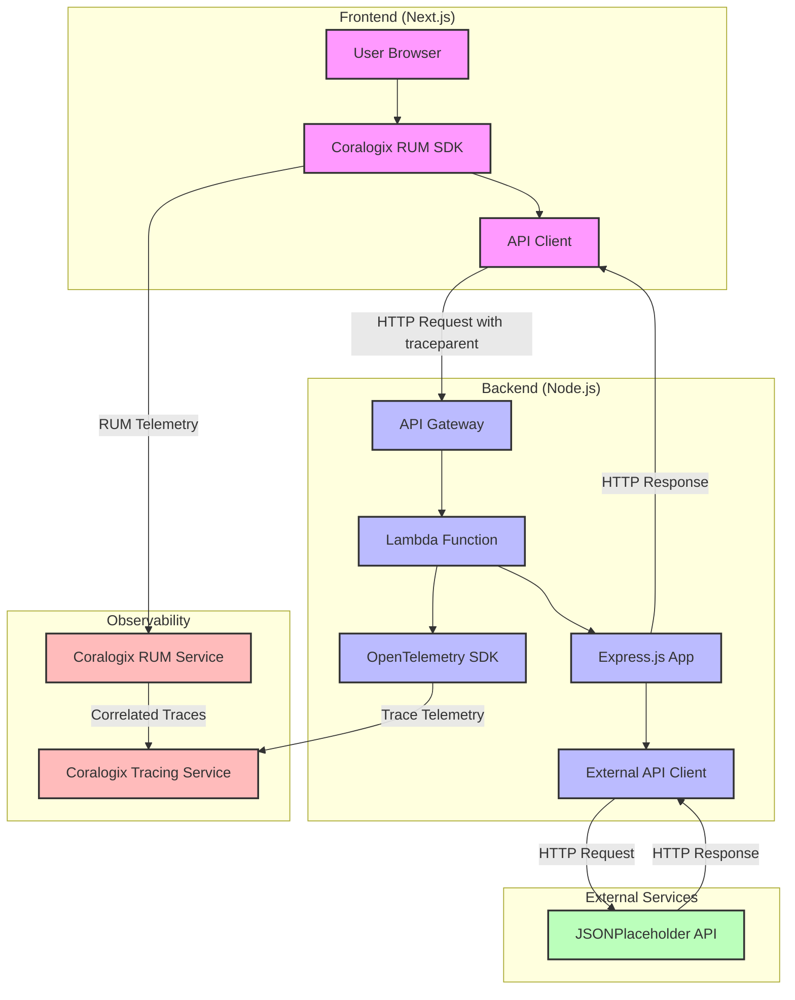

```mermaid
graph TD
    subgraph "Frontend (Next.js)"
        A[User Browser] --> B[Coralogix RUM SDK]
        B --> C[API Client]
    end
    
    subgraph "Backend (Node.js)"
        D[API Gateway] --> E[Lambda Function]
        E --> F[OpenTelemetry SDK]
        E --> G[Express.js App]
        G --> H[External API Client]
    end
    
    subgraph "External Services"
        I[JSONPlaceholder API]
    end
    
    subgraph "Observability"
        J[Coralogix RUM Service]
        K[Coralogix Tracing Service]
    end
    
    C -->|HTTP Request with traceparent| D
    H -->|HTTP Request| I
    I -->|HTTP Response| H
    G -->|HTTP Response| C
    
    B -->|RUM Telemetry| J
    F -->|Trace Telemetry| K
    
    J -->|Correlated Traces| K
    
    classDef frontend fill:#f9f,stroke:#333,stroke-width:2px;
    classDef backend fill:#bbf,stroke:#333,stroke-width:2px;
    classDef external fill:#bfb,stroke:#333,stroke-width:2px;
    classDef observability fill:#fbb,stroke:#333,stroke-width:2px;
    
    class A,B,C frontend;
    class D,E,F,G,H backend;
    class I external;
    class J,K observability;
```
