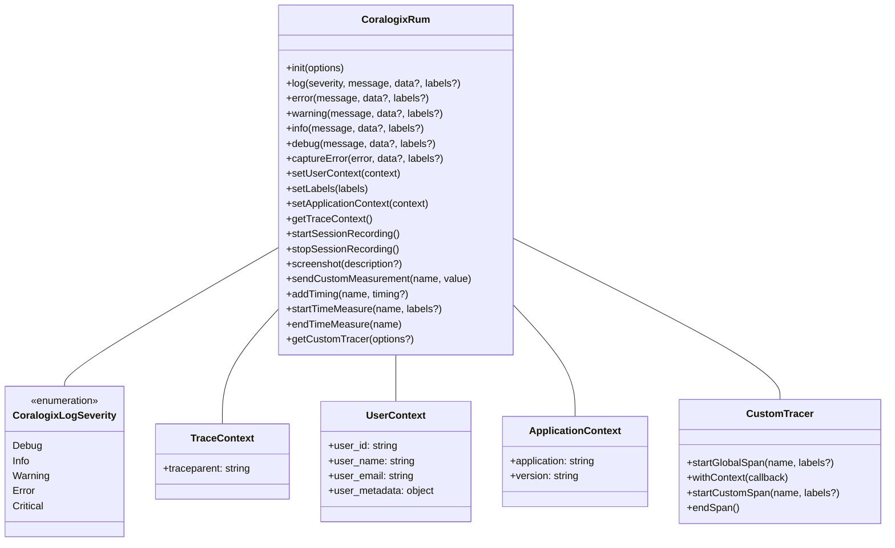

```mermaid
classDiagram
    class CoralogixRum {
        +init(options)
        +log(severity, message, data?, labels?)
        +error(message, data?, labels?)
        +warning(message, data?, labels?)
        +info(message, data?, labels?)
        +debug(message, data?, labels?)
        +captureError(error, data?, labels?)
        +setUserContext(context)
        +setLabels(labels)
        +setApplicationContext(context)
        +getTraceContext()
        +startSessionRecording()
        +stopSessionRecording()
        +screenshot(description?)
        +sendCustomMeasurement(name, value)
        +addTiming(name, timing?)
        +startTimeMeasure(name, labels?)
        +endTimeMeasure(name)
        +getCustomTracer(options?)
    }
    
    class CoralogixLogSeverity {
        <<enumeration>>
        Debug
        Info
        Warning
        Error
        Critical
    }
    
    class TraceContext {
        +traceparent: string
    }
    
    class UserContext {
        +user_id: string
        +user_name: string
        +user_email: string
        +user_metadata: object
    }
    
    class ApplicationContext {
        +application: string
        +version: string
    }
    
    class CustomTracer {
        +startGlobalSpan(name, labels?)
        +withContext(callback)
        +startCustomSpan(name, labels?)
        +endSpan()
    }
    
    CoralogixRum -- CoralogixLogSeverity
    CoralogixRum -- TraceContext
    CoralogixRum -- UserContext
    CoralogixRum -- ApplicationContext
    CoralogixRum -- CustomTracer
```
