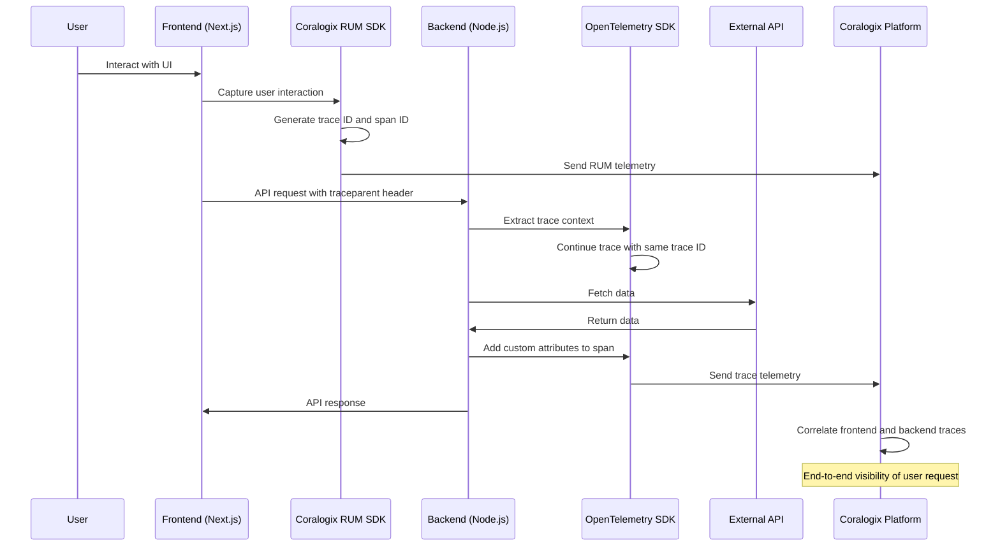

```mermaid
sequenceDiagram
    participant User as User
    participant Frontend as Frontend (Next.js)
    participant CoralogixRUM as Coralogix RUM SDK
    participant Backend as Backend (Node.js)
    participant OpenTelemetry as OpenTelemetry SDK
    participant ExternalAPI as External API
    participant Coralogix as Coralogix Platform
    
    User->>Frontend: Interact with UI
    Frontend->>CoralogixRUM: Capture user interaction
    CoralogixRUM->>CoralogixRUM: Generate trace ID and span ID
    CoralogixRUM->>Coralogix: Send RUM telemetry
    
    Frontend->>Backend: API request with traceparent header
    Backend->>OpenTelemetry: Extract trace context
    OpenTelemetry->>OpenTelemetry: Continue trace with same trace ID
    
    Backend->>ExternalAPI: Fetch data
    ExternalAPI->>Backend: Return data
    
    Backend->>OpenTelemetry: Add custom attributes to span
    OpenTelemetry->>Coralogix: Send trace telemetry
    
    Backend->>Frontend: API response
    
    Coralogix->>Coralogix: Correlate frontend and backend traces
    
    Note over Coralogix: End-to-end visibility of user request
```
